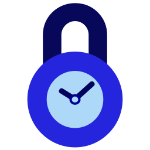

# TimeLock (Chrome Extension)

[Main README (Chinese)](README.md)

> Inspired by [Mr. He's video][mr_he_video].

Internet is NOT interesting before you have MIND. Wasting time mindlessly is never interesting.

***As a mindful person***, you should think twice for what are supposed to be done before entering any website. Then, finish the task quickly, or entertain yourself with plan.

***However, most of you are not mindful enough***. Your mind and time will easily fly away when you are attracted by all kinds of fancy contents. 

TimeLock will help you, who has mind but not mindful enough. Before entering any attractive website, you must think twice for what to do and estimate the time needed, that is the last second your are mindful. Then, set a time limit with TimeLock and enjoy your mindless time. TimeLock will block the webpage when time's up and try to remind you.

> Ask yourself before opening an app:
> - Why you open it?
> - How long will you spend?
> - Do you have any alternative to do?
> 
> -- Mr. He

Three questions above also applies before browsing any website.

---

# Features
- Automatic webpage monitoring, blocking, timing and unblocking
- Customize website blacklist & whitelist
- Functional popup
  - Countdown display
  - Stop timing earlier

# Installation

The extension haven't been published in Chrome Web Store.

# Requirement

Use the latest Chrome is always fine.  
(I'm too lazy to test capability on old version Chrome)

# TODO

- [ ] popup: add current website to blacklist
- [ ] user manual
- [ ] selection page：set unlock time by ending point
- [ ] internationalization (at least zh_CN + en)
- [ ] notification ending time approaching
- [ ] calm down time
- [ ] customize monitor working days
- [ ] display motto on blocking page
- [ ] display mottos
- [ ] option exporting & importing
- [ ] option syncing
- [x] refine README.md
- [x] customize default unlock time
- [x] acknowledgement in options page
- [x] stop timer earlier manually
- [x] monitor whitelist
- [x] select time and unlock before entering website in blacklist (core function 1)
- [x] customize blacklist (core function 2)
- [x] popup: countdown display
- [x] polish the extension icon
- The functionalities that are unlikely to appear
  - [ ] limited local storage
  - [ ] set accumulated time limit
  - [ ] browsing history statistic

[mr_he_channel]: https://www.youtube.com/c/hetongxue
[mr_he_video]: https://www.youtube.com/watch?v=mCEjEkgU1AA
[mr_he_app]: http://download.yitangyx.cn/test/student-he/new.html?202001
