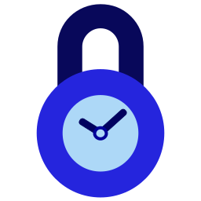

# SecondLock (Chrome Extension)

[中文 README](README.zh_CN.md)

> Inspired by [Mr. He's video][mr_he_video].

Internet is NOT interesting before you have MIND. Wasting time mindlessly is never interesting.

**_As a mindful person_**, you should think twice for what are supposed to be done before entering any website. Then, finish the task quickly, or entertain yourself with plan.

**_However, most of you are not mindful enough_**. Your mind and time will easily fly away when you are attracted by all kinds of fancy contents.

SecondLock will help you, who has mind but not mindful enough. Before entering any attractive website, you must think twice for what to do and estimate the time needed, that is the last second your are mindful. Then, set a time limit with SecondLock and enjoy your mindless time. SecondLock will block the webpage when time's up and try to remind you.

> Ask yourself before opening an app:
>
> - Why do you open it?
> - How long will you spend?
> - Do you have any alternative to do?
>
> -- Mr. He

Three questions above also applies before browsing any website.

---

# Features

- Automatic webpage monitoring, blocking, timing and unblocking
- Customize website blacklist & whitelist
- Functional popup
  - Countdown display
  - Stop timing earlier
- Customize default unlock durations choices

# Installation

The extension haven't been published in Chrome Web Store.

The extension haven't been published in Firefox Browser Add-ons.

# Requirement

Use the latest Chrome is always fine.

I'm just too lazy to test capability on old version Chrome (XD).

Capability on Chromium and Microsoft Edge (Chromium Kernel) haven't been tested.

# Update

- v0.3.0
  - Add capability: Firefox

- v0.2.1

  - change extension name.
  - bug fix: whitelist does not work when manually stop timing.

- v0.2.0

  - Support simplified Chinese (zh-CN)
  - Stop timing earlier manually
  - Display local storage usage

- v0.1.2

  - Customize website whitelist

- v0.1.1

  - Customize default unlock durations choices

- v0.1.0
  - Automatic webpage monitoring, blocking, timing and unblocking
  - Customize website blacklist
  - Countdown display

# TODO

- [ ] popup: add current website to blacklist
- [ ] user manual
- [ ] notification on ending time approaching
- [ ] calm down time
- [ ] customize monitor working days
- [ ] display motto on blocking page
- [ ] display mottos
- [ ] option exporting & importing
- [ ] option syncing
- [ ] options: close website on time's up without showing time's up page
- [ ] options: customize blocking page on time's up
- [ ] options: leave one newtab when all tabs in current window are closed
- [ ] rewrite frontend with a framework
- [x] support Firefox
- [x] selection page：set unlock time by ending point
- [x] internationalization (at least zh-CN + en)
- [x] refine README.md
- [x] customize default unlock time
- [x] acknowledgement in options page
- [x] stop timer earlier manually
- [x] monitor whitelist
- [x] select time and unlock before entering website in blacklist (core function 1)
- [x] customize blacklist (core function 2)
- [x] popup: countdown display
- [x] polish the extension icon
- The functionalities that are unlikely to appear
  - [ ] limited local storage
  - [ ] set accumulated time limit
  - [ ] browsing history statistic

[mr_he_channel]: https://www.youtube.com/c/hetongxue
[mr_he_video]: https://www.youtube.com/watch?v=mCEjEkgU1AA
[mr_he_app]: http://download.yitangyx.cn/test/student-he/new.html?202001
